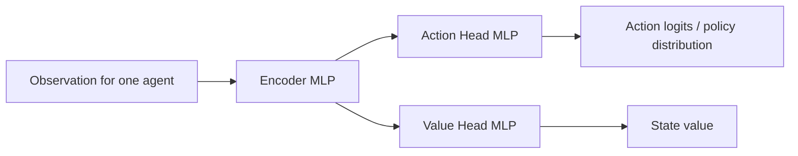
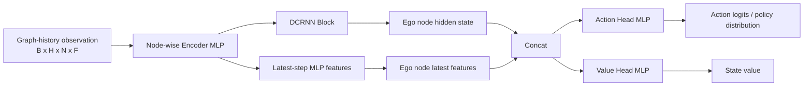
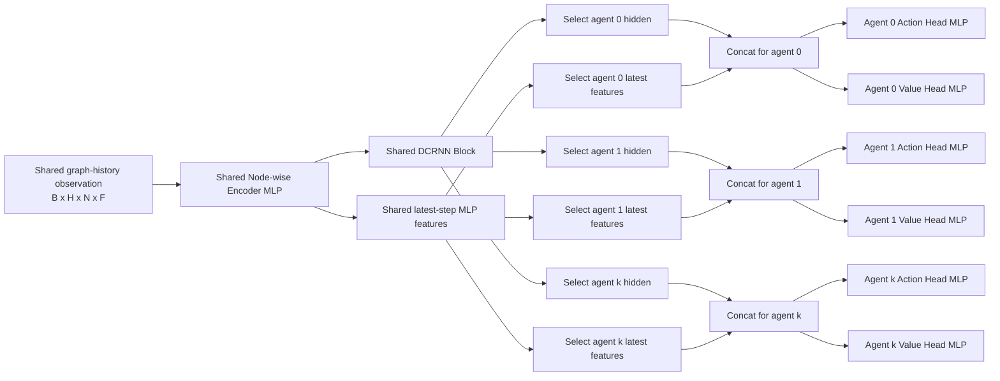
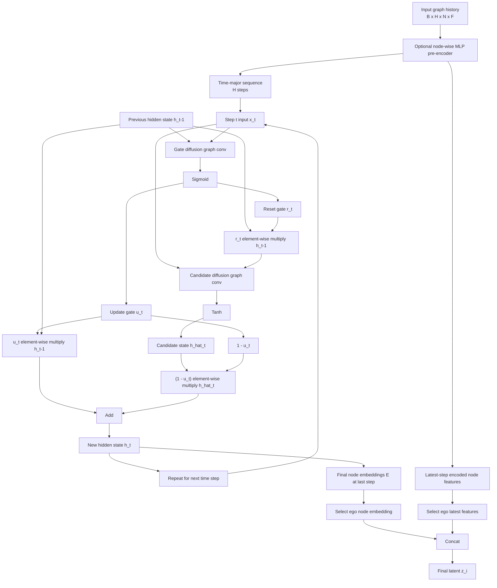
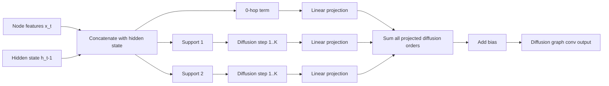
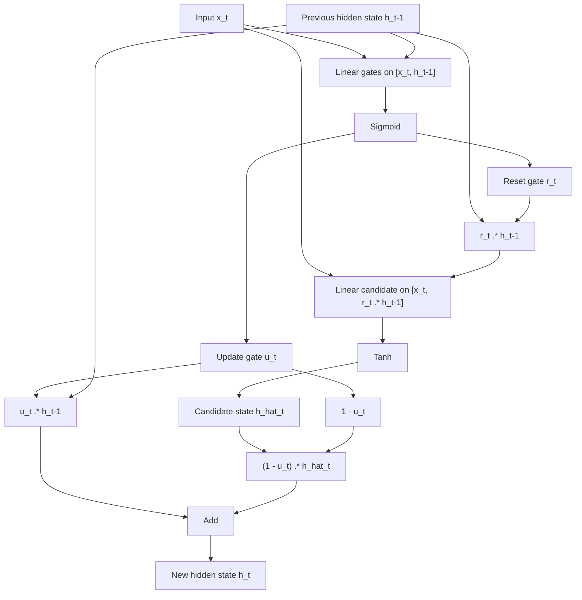
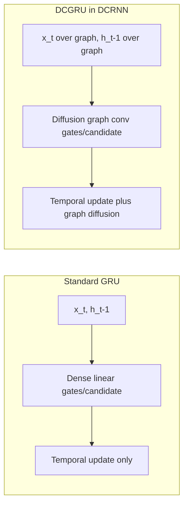

# Thesis Architecture Diagrams

This page collects Mermaid diagrams for the PPO variants used in this thesis
codebase, along with a detailed DCRNN block view and a GRU comparison.

The PPO+DCRNN diagrams below match the current implementation in:

- `sumo_rl/models/dcrnn.py`
- `sumo_rl/agents/ppo/rllib_module.py`
- `configs/algorithm/ppo_dcrnn_mlp.yaml`
- `configs/algorithm/ppo_dcrnn_shared_mlp.yaml`

For plain `ppo`, RLlib uses its standard feed-forward path rather than a
custom module in this repository, so the diagram below is a thesis-style
conceptual MLP encoder plus MLP actor/value heads.

## PPO

## PPO + Independent DCRNN + MLP

This matches `ppo_dcrnn_mlp`. The node-wise MLP pre-encoder feeds two paths:
one path enters the DCRNN encoder, while the latest-step MLP features also skip
directly to the final concatenation. The final ego latent is:

`latent_i = concat(dcrnn_hidden_i, latest_mlp_features_i)`

## PPO + Shared DCRNN + MLP

This matches `ppo_dcrnn_shared_mlp`. Multiple agents keep separate policy/value
heads, but all of them reuse one shared encoder.

## DCRNN Block Detail

This reflects the current `DCRNNBackbone` and `DCGRUCell` flow:

- optional node-wise MLP pre-encoder
- stacked history processed by a DCGRU
- diffusion graph convolution inside both gate and candidate computations
- final ego latent formed by concatenating DCRNN hidden state and latest MLP
  features

## Diffusion Layer Inside DCGRU

This zooms in on the diffusion graph convolution used by the gate and candidate
branches.

## Standard GRU Flow

This is the standard GRU baseline for comparison. The key difference is that
the linear layers operate on vector features directly, without graph diffusion
over neighbors.

## DCRNN vs GRU

Practical summary:

- `ppo`: one agent uses an MLP encoder, then separate MLP action and value
  heads.
- `ppo_dcrnn_mlp`: each agent owns its own MLP plus DCRNN encoder and its own
  heads.
- `ppo_dcrnn_shared_mlp`: agents keep separate heads but reuse one shared MLP
  plus DCRNN encoder.
- GRU models time only.
- DCRNN models time and neighbor-to-neighbor diffusion on the traffic-signal
  graph.
