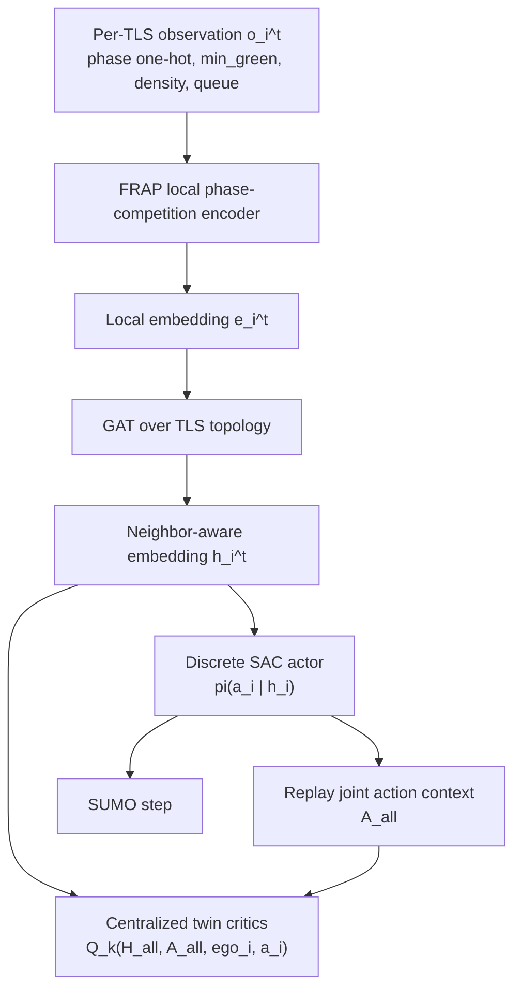
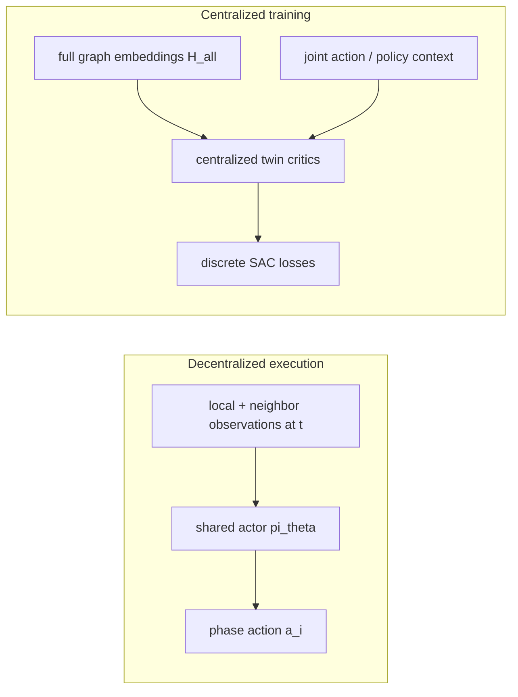

# Thesis Experiments

This page contains the thesis-specific experiment workflow built on top of the upstream SUMO-RL examples.
If you are onboarding to the codebase, read [docs/thesis/engineering_guide.md](engineering_guide.md) first.

This is the canonical thesis runbook. Keep generic launch, validation, resume,
export, and W&B workflows here. Use the neighboring thesis pages as
role-specific contributor notes, reference notes, or archive material.

## Doc Map

- Installation and optional thesis extras: [`README.md`](../../README.md) and the Optional Install section on this page
- Experiment launch, validation, resume, rollout export, and W&B: this page
- Fixed-time/manual control reference: [docs/thesis/manual_control.md](manual_control.md)
- Static baseline reference: [docs/thesis/static_baselines.md](static_baselines.md)
- Contributor engineering architecture notes: [docs/thesis/engineering_guide.md](engineering_guide.md)
- Deep reference material: [docs/thesis/fgs_v1_pipeline.md](fgs_v1_pipeline.md), [docs/thesis/resource_usage_smoke.md](resource_usage_smoke.md), [docs/thesis/architecture_diagrams.md](architecture_diagrams.md), [docs/thesis/pseudocode.md](pseudocode.md)

The thesis launchers now expose the fixed-time and max-pressure RESCO presets plus a shared RLlib launcher for PPO, DQN, FRAP, SAC, and DCRNN.

## Supported Surface

This page is the canonical supported-surface matrix for the thesis workflow.
Use the following status labels consistently:

- `supported`: part of the supported thesis baseline that later cleanup phases should keep aligned across docs, presets, and tests
- `experimental`: available for research or ablation work, but not part of the supported thesis baseline
- `alias`: compatibility-only name for an existing canonical method

### Controllers

| Name | Status | Notes |
| --- | --- | --- |
| `fixed_time` | `supported` | Supported controller with scenario-first benchmark presets |
| `static_max_pressure` | `supported` | Supported controller with scenario-first benchmark presets |

### RLlib methods

| Name | Status | Launch surface | Notes |
| --- | --- | --- | --- |
| `ppo` | `supported` | shared RLlib launcher | Canonical public method |
| `dqn` | `supported` | shared RLlib launcher | Canonical public method |
| `dqn_dcrnn` | `supported` | shared RLlib launcher | Canonical public DCRNN name |
| `frap` | `supported` | shared RLlib launcher | Canonical public method |
| `colight` | `supported` | shared RLlib launcher | Canonical public method |
| `fgs` | `supported` | preset-backed and shared RLlib launcher | Supported where thesis presets exist today |
| `fgs_ppo` | `supported` | preset-backed and shared RLlib launcher | Supported where thesis presets exist today |
| `sac_builtin` | `supported` | preset-backed and shared RLlib launcher | Reference RLlib SAC baseline |
| `sac_mlp` | `supported` | shared RLlib launcher | Canonical public SAC customization surface |
| `ppo_dcrnn_mlp` | `experimental` | shared RLlib launcher | PPO graph-observation ablation |
| `ppo_dcrnn_shared_mlp` | `experimental` | shared RLlib launcher | PPO parameter-sharing ablation |
| `dqn_dcrnn_mlp` | `experimental` | shared RLlib launcher | DCRNN pre-encoder ablation |
| `fgsv2` | `experimental` | shared RLlib launcher | Broader research variant |
| `dcrnn` | `alias` | shared RLlib launcher | Compatibility alias for `dqn_dcrnn` |
| `sac_custom` | `alias` | shared RLlib launcher | Compatibility alias for `sac_mlp` |

### Scenarios

| Tier | Names | Notes |
| --- | --- | --- |
| Supported benchmark scenarios | `resco_cologne1`, `resco_cologne3`, `resco_cologne8`, `resco_ingolstadt1`, `resco_ingolstadt7`, `resco_ingolstadt21` | Thesis benchmark matrix |
| Supported smoke/dev scenarios | `resco_grid4x4`, `single_intersection` | Supported for smoke checks and iteration, but not part of the benchmark matrix |
| Available but not benchmark-supported | all remaining scenario configs and convenience aliases | Keep available unless explicitly removed later, but do not treat them as thesis benchmark commitments |

### Preset policy

- Static baselines are supported through the scenario-first benchmark presets under the six RESCO benchmark scenarios.
- FGS and FGS PPO benchmark support is limited to the scenarios where preset-backed recipes already exist today.
- RLlib methods without scenario-first preset files can still be supported when they are listed above as canonical methods, but that support is through the shared RLlib launcher rather than preset-backed benchmark recipes.

## Experiment directory policy

- Top-level `experiments/` is reserved for supported launchers and utilities.
- Archive/reference notebooks and analysis helpers live under `experiments/archive/`.
- Archive workflows may write ignored local outputs under `experiments/artifacts/`, but that tree is not part of the supported run artifact contract.
- Use `python scripts/cleanup_local_artifacts.py --dry-run` to preview local artifact cleanup and `python scripts/cleanup_local_artifacts.py --yes` to remove the known ignored run directories safely.

## Hydra
Hydra is the experiment composition layer for the thesis workflow.

### Config layout

- `configs/scenario/`: road-network and environment setup
- `configs/algorithm/`: method hyperparameters
- `configs/rllib.yaml`: shared RLlib launcher config
- `configs/presets/<scenario>/`: scenario-first runnable presets
- [`configs/presets/README.md`](../../configs/presets/README.md): canonical layout guide for presets, public names, and support terminology

### Runtime conventions

- Each run gets its own output directory under `outputs/<experiment-name>/<timestamp>/`.
- A local CSV log is written to `outputs/<experiment-name>/<timestamp>/logs/metrics.csv`.
- Episode horizon is controlled by `experiment.episode_seconds`. To estimate decision steps, divide by `delta_time`.
- RLlib validation is episode-based by default through `experiment.validation_interval_episodes=5`. `logging.eval_freq` is only the step-based fallback.
- Training trace logging defaults to `logging.trace_mode=training`. Use `logging.trace_mode=debug` to add learner, replay, entropy, and return diagnostics under `debug/*`.
- RLlib checkpoints are written under `checkpoints/<algorithm_kind>/periodic/`, and training can resume from `logging.resume_from_checkpoint=<checkpoint-dir>`.

### Validation and metrics defaults

- When training with `+env.kwargs.use_libsumo=true`, manual validation and final evaluation stay on TraCI by default through `logging.eval_use_libsumo=false`.
- Do not combine Libsumo training with RLlib-native evaluation through `algorithm.params.evaluation_interval`; the runner rejects that combination.
- Episode-end benchmark rows use the shared thesis summary fields:
  - `resco_avg_delay`, `resco_trip_time`, `resco_wait`
  - `resco_queue`, `resco_max_queue`
  - namespaced `efficiency_*` and `safety_*`
- Tripinfo XML is generated for metric computation and deleted by default. Set `logging.save_tripinfo_output=true` to keep raw XML under `tripinfo/`.
- Validation image payloads can be disabled independently with the `logging.validation_log_*` switches when you want lighter runs.

### Common commands

Example:
```bash
python experiments/fixed_time.py scenario=resco_grid4x4
```

Supported example entrypoints:

```bash
python experiments/static_max_pressure.py scenario=resco_cologne1
python experiments/rllib.py algorithm=ppo scenario=resco_grid4x4
python experiments/rllib.py algorithm=dqn scenario=resco_cologne1
python experiments/rllib.py algorithm=frap scenario=resco_grid4x4
python experiments/rllib.py algorithm=dqn_dcrnn scenario=resco_grid4x4 experiment.episodes=1
python experiments/rllib.py algorithm=colight scenario=resco_grid4x4
python experiments/rllib.py algorithm=fgs scenario=resco_grid4x4
python experiments/rllib.py algorithm=sac_builtin scenario=resco_ingolstadt1
python experiments/rllib.py algorithm=sac_mlp scenario=resco_ingolstadt7
```

Experimental variants remain available through the shared RLlib launcher, but
they are not part of the supported thesis baseline. Use the supported-surface
matrix above before treating a method as a maintained benchmark commitment.

### Scenario-first presets

Launch scenario-first RLlib presets by keeping the config root at `configs/`
and passing the preset path as the config name:

```bash
python experiments/rllib.py --config-name presets/resco_cologne8/fgs_mlp_gat_sac
python experiments/rllib.py --config-name presets/resco_cologne8/sac_builtin
```

### Resume training

To continue RLlib training from a compatible checkpoint through the main Hydra
launcher, pass:

```bash
python experiments/rllib.py algorithm=ppo scenario=resco_grid4x4 logging.resume_from_checkpoint=outputs/rllib/2026-06-21_12-00-00/checkpoints/ppo logging.checkpoint_every_episodes=50
```

Periodic RLlib checkpoints are enabled by default and are written under
`outputs/<run>/checkpoints/<algorithm_kind>/periodic/`.

### Validate methods

For thesis-style validation across RLlib checkpoints and static baselines, use
the unified validation CLI:

```bash
python experiments/validate_methods.py --controller rllib --run-dir outputs/rllib/2026-06-21_12-00-00 --checkpoint-selector best --seeds 1 2 3
python experiments/validate_methods.py --controller fixed_time --scenario resco_grid4x4 --seeds 1 2 3
python experiments/validate_methods.py --controller static_max_pressure --scenario resco_grid4x4 --seeds 1 2 3
```

The CLI writes a compact terminal table, per-seed CSV/JSON artifacts, and
validation plots under a dedicated output directory.

### Export rollouts

To export an MP4 rollout from a trained RLlib checkpoint, use:

```bash
python experiments/record_rollout.py --controller rllib --run-dir outputs/rllib/2026-06-21_12-00-00 --checkpoint outputs/rllib/2026-06-21_12-00-00/checkpoints/ppo/checkpoint_000001 --output outputs/rllib/2026-06-21_12-00-00/videos/rollout.mp4
```

For static baselines, use the same recorder with a different controller:

```bash
python experiments/record_rollout.py --controller fixed_time --scenario resco_grid4x4 --output outputs/recordings/fixed_time.mp4
python experiments/record_rollout.py --controller static_max_pressure --scenario resco_grid4x4 --output outputs/recordings/max_pressure.mp4
```

The recorder restores the checkpoint, runs one evaluation rollout with
`render_mode=rgb_array`, and writes an MP4 file. Use `--frame-skip` to reduce
video size or `--max-steps` for a short smoke recording. The MP4 writer needs
either OpenCV or `imageio` plus `imageio-ffmpeg` installed; the
`.[experiments]`, `.[rendering]`, and `.[all]` extras include the `imageio`
path. You can pass extra Hydra overrides for static controllers with repeated
`--override` flags, for example `--override env.kwargs.num_seconds=600`.

## Method Notes

PPO and DQN default to independent policies. To switch to a shared policy, use
`algorithm.params.policy_mode=shared`.

### Supported RLlib methods

- `ppo`: standard RLlib PPO path through the shared launcher.
- `dqn`: standard RLlib DQN path through the shared launcher.
- `dqn_dcrnn`: canonical DCRNN DQN method. It uses graph-history observations and diffusion message passing inside the DCRNN encoder. `dcrnn` remains the compatibility alias.
- `frap`: DQN-family RLlib method with the paper's phase-competition Q-network.
- `colight`: shared-policy graph-attention DQN-family method. It also writes topology overlays under the run directory.
- `sac_builtin`: reference RLlib discrete SAC baseline.
- `sac_mlp`: project-owned SAC RLModule surface for actor and critic MLP customization. `sac_custom` remains the compatibility alias.
- `fgs`: thesis graph-attention SAC reference. It combines a local FRAP or MLP encoder with explicit GAT or GATv2 message passing over the traffic-signal graph. See [docs/thesis/fgs_v1_pipeline.md](fgs_v1_pipeline.md) for the full pipeline.
- `fgs_ppo`: FGS observation and encoder stack with PPO heads instead of SAC heads.

### Experimental variants

- PPO ablations: `ppo_dcrnn_mlp`, `ppo_dcrnn_shared_mlp`
- DQN ablations: `dqn_dcrnn_mlp`
- Research variants: `fgsv2`

These variants stay available for research and reproduction, but they are not
part of the supported thesis baseline.

### Method-specific notes

- DCRNN-based methods use graph-history observations shaped as `[history_len, num_nodes, phase_one_hot_min_green_density_queue_features]`.
- Current DQN+DCRNN defaults trim replay pressure on larger RESCO networks with smaller history and learner-batch settings.
- FGS is the repo's main reference for explicit graph-attention communication in SAC-style training. If you need the deeper architecture explanation, use [docs/thesis/fgs_v1_pipeline.md](fgs_v1_pipeline.md).





For the intended smoke path, use the `marl` conda environment:

```bash
conda run -n marl python -m pytest tests/models/test_fgs.py tests/models/test_sac_build_config.py tests/models/test_sac_model_config.py tests/models/test_frap.py tests/models/test_colight.py
conda run -n marl python experiments/rllib.py algorithm=fgs scenario=single_intersection experiment.episodes=1 experiment.episode_seconds=60 logging=disabled
```

Method references: FRAP, "Learning Phase Competition for Traffic Signal
Control" (arXiv:1905.04722); CoLight, "Learning Network-level Cooperation for
Traffic Signal Control" (arXiv:1905.05717); SAC, "Soft Actor-Critic:
Off-Policy Maximum Entropy Deep Reinforcement Learning with a Stochastic Actor"
(arXiv:1801.01290); and "Soft Actor-Critic for Discrete Action Settings"
(arXiv:1910.07207).

## Weights & Biases
Weights & Biases is used for experiment tracking.

- W&B logs configs, metrics, and run metadata
- The repo defaults to offline mode so local runs do not require an API key
- To use online logging, authenticate outside the repo with `wandb login` or set `WANDB_API_KEY` in your environment
- To push runs from a repo-local `.env`, set `WANDB_API_KEY`, `WANDB_PROJECT`, and `WANDB_ENTITY`

Example:
```bash
python experiments/static_max_pressure.py scenario=resco_ingolstadt7 logging.mode=online logging.project=my-thesis
```

To download tagged W&B runs for local inspection, reuse the same repo-root
`.env` and run:

```bash
python experiments/download_wandb_runs.py --tag thesis --tag resco_grid4x4 --dry-run
python experiments/download_wandb_runs.py --tag thesis --tag resco_grid4x4
```

By default the downloader writes matching runs to
`wandb_downloads/<entity>/<project>/` and saves `run.json`, `config.json`,
`summary.json`, and `history.jsonl` for each exported run.

## Optional Install
To use the Hydra and W&B experiment layer, install the optional extras:
```bash
pip install -e ".[experiments]"
pip install -e ".[rllib]"
pip install -e ".[rllib-custom]"
```

## Notes
- These additions do not replace the upstream SUMO-RL API.
- The existing environment and algorithm examples still run through the same underlying SUMO-RL code paths.
- The RESCO summary log is the canonical run artifact for comparing against the benchmark formulas.
- Run names now put the scenario first, for example `resco_grid4x4__fixed_time` or `resco_cologne1__static_max_pressure`.
- Short smoke runs should watch the `train/` and `validation/` traces in addition to the episode-end summary rows.
- The trip-based `resco_*` metrics aggregate dispatched non-ghost vehicles: finished plus running-unfinished, while still excluding undeparted and ghost vehicles.
