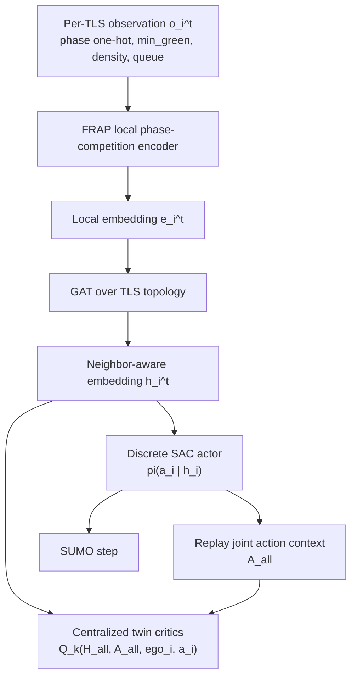
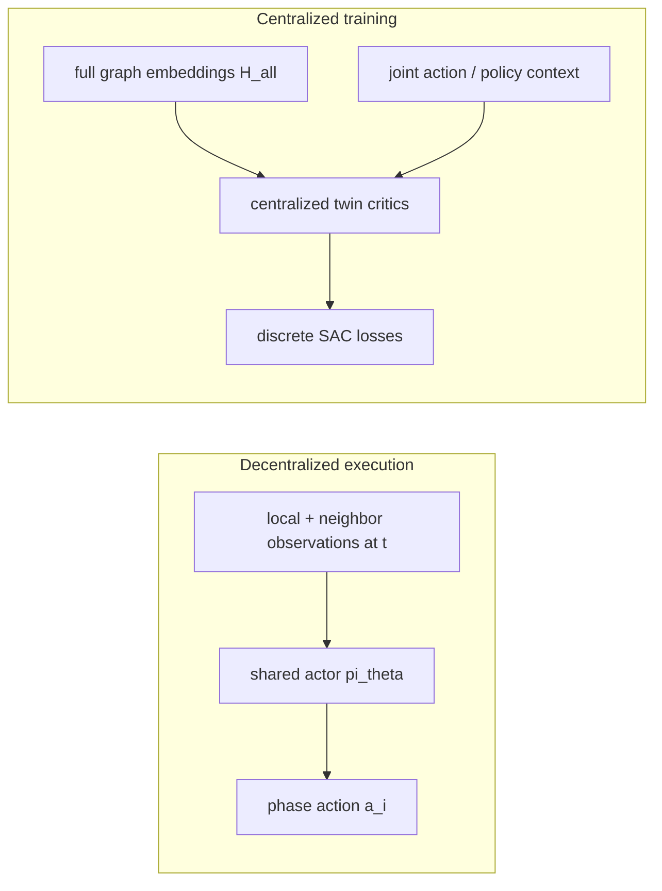

# Thesis Experiments

This page contains the thesis-specific experiment workflow built on top of the upstream SUMO-RL examples.
If you are onboarding to the codebase, read [docs/thesis/engineering_guide.md](engineering_guide.md) first.

If you are looking for fixed-time/manual traffic control, read [docs/thesis/manual_control.md](manual_control.md) after this page.
If you want the RESCO static baselines, read [docs/thesis/static_baselines.md](static_baselines.md) next.
If you need the resource-usage smoke metrics or the parameter-counting
definitions behind those tables, read
[docs/thesis/resource_usage_smoke.md](resource_usage_smoke.md).

The thesis launchers now expose the fixed-time and max-pressure RESCO presets plus a shared RLlib launcher for PPO, DQN, FRAP, SAC, and DCRNN.

## Hydra
Hydra is used as the experiment composition layer.

- Each runnable example has a Hydra config in `configs/`
- Configs define the environment, algorithm, and logging settings
- Command-line overrides let you change seeds, paths, and hyperparameters without editing code
- Each run gets its own output directory under `outputs/<experiment-name>/<timestamp>/`
- A local metrics CSV is written to `outputs/<experiment-name>/<timestamp>/logs/metrics.csv` for quick debugging
- Episode horizon is configured in seconds with `experiment.episode_seconds`. If you need the decision-step horizon, divide by `delta_time`; for example, `3600` seconds with `delta_time=5` is about `720` steps.
- RLlib validation is episode-based by default with `experiment.validation_interval_episodes=5`; `logging.eval_freq` is only the step-based fallback when the episode interval is unset.
- Training trace logging defaults to `logging.trace_mode=training`; switch to `logging.trace_mode=debug` to add RLlib learner, replay, return, and entropy diagnostics under `debug/*`.
- When training with `+env.kwargs.use_libsumo=true`, manual validation and final evaluation stay on TraCI by default via `logging.eval_use_libsumo=false`.
- Do not combine Libsumo training with RLlib-native evaluation through `algorithm.params.evaluation_interval`; the runner rejects that configuration because it conflicts with the project-side manual validation path.
- The runner now logs episode-end RESCO summaries plus namespaced efficiency and safety metrics, using:
  - `resco_avg_delay` from dispatched non-ghost SUMO tripinfo rows: finished plus running-unfinished, excluding undeparted
  - `resco_trip_time` from the same dispatched row set: `duration`
  - `resco_wait` from the same dispatched row set: `waitingTime`
  - `resco_queue` and `resco_max_queue` from the live queue metrics
  - unfinished and undeparted vehicles at episode end are still tracked separately under `tripinfo/*unfinished*` counts, but only undeparted vehicles stay excluded from the `resco_*` aggregates
  - `efficiency_*` for queue, speed, waiting-time, and throughput diagnostics in episode summaries and eval/final outputs
  - `safety_*` for emergency-brake and teleport/unsafe-event counts
  - the RLlib training trace keeps only the episode-facing throughput totals in `train/*`; the end-of-episode live snapshot diagnostics stay under `debug/*`
  - tripinfo XML is generated to compute metrics and deleted by default; set `logging.save_tripinfo_output=true` to keep the raw XML files under `outputs/<experiment-name>/<timestamp>/tripinfo/`
  - RLlib can resume from `logging.resume_from_checkpoint=<checkpoint-dir>` and saves periodic checkpoints every 50 completed episodes by default under `checkpoints/<algorithm_kind>/periodic/`
  - validation image payloads can be disabled independently with `logging.validation_log_action_shares=false`, `logging.validation_log_action_timelines=false`, `logging.validation_log_phase_queues=false`, and `logging.validation_log_tripinfo_distributions=false`
- The config layout is split into:
  - `configs/scenario/` for network and road-network setup
  - `configs/algorithm/` for the method hyperparameters
  - `configs/rllib.yaml` for the shared RLlib launcher
  - scenario-first presets such as `configs/presets/resco_grid4x4/fixed_time.yaml` and `configs/presets/resco_cologne1/static_max_pressure.yaml`
  - the canonical layout guide in [`configs/presets/README.md`](../../configs/presets/README.md), which now also explains the RLlib algorithm files

Example:
```bash
python experiments/fixed_time.py scenario=resco_grid4x4
```

Other common entrypoints:

```bash
python experiments/static_max_pressure.py scenario=resco_cologne1
python experiments/rllib.py algorithm=ppo scenario=resco_grid4x4
python experiments/rllib.py algorithm=ppo_dcrnn_mlp scenario=resco_grid4x4 experiment.episodes=1
python experiments/rllib.py algorithm=ppo_dcrnn_shared_mlp scenario=resco_grid4x4 experiment.episodes=1
python experiments/rllib.py algorithm=dqn scenario=resco_cologne1
python experiments/rllib.py algorithm=frap scenario=resco_grid4x4
python experiments/rllib.py algorithm=dqn_dcrnn scenario=resco_grid4x4 experiment.episodes=1
python experiments/rllib.py algorithm=dqn_dcrnn_mlp scenario=resco_grid4x4 experiment.episodes=1
python experiments/rllib.py algorithm=colight scenario=resco_grid4x4
python experiments/rllib.py algorithm=fgs scenario=resco_grid4x4
python experiments/rllib.py algorithm=sac_builtin scenario=resco_ingolstadt1
python experiments/rllib.py algorithm=sac_mlp scenario=resco_ingolstadt7
python experiments/rllib.py algorithm=sac_dcrnn_actor scenario=resco_grid4x4 experiment.episodes=1
python experiments/rllib.py algorithm=sac_dcrnn_actor_mlp scenario=resco_grid4x4 experiment.episodes=1
python experiments/rllib.py algorithm=sac_dcrnn_full scenario=resco_grid4x4 experiment.episodes=1
python experiments/rllib.py algorithm=sac_dcrnn_full_mlp scenario=resco_grid4x4 experiment.episodes=1
```

PPO and DQN default to independent policies. To switch to a shared policy, override
`algorithm.params.policy_mode=shared` on the command line.

`algorithm=ppo_dcrnn_mlp` keeps PPO on independent policies, but swaps the flat
per-agent observation for the same graph-history wrapper used by the DCRNN DQN
and SAC variants. The wrapper builds one directed traffic-signal graph from
incoming/outgoing lane connectivity, pads every node to a shared lane width, and
returns a rolling tensor shaped as
`[history_len, num_nodes, phase_one_hot_min_green_density_queue_features]`.
Each PPO policy still
belongs to one traffic signal, but its backbone sees the full graph history,
runs diffusion message passing inside the DCRNN, and then keeps only the ego
node's latent for the PPO policy head and value head. There is no separate GAT
or explicit post-DCRNN communication block in this PPO path.
For memory, the PPO+DCRNN config now uses `sgd_minibatch_size=64` so the
learner holds smaller graph minibatches on GPU without changing the DCRNN
architecture itself.

`algorithm=ppo_dcrnn_shared_mlp` keeps the same graph-history observation path
and independent policy mapping, but shares one DCRNN+MLP encoder across the PPO
modules for all traffic signals. Each policy still owns its own actor and value
heads, and the learner updates the shared encoder and all heads through one
optimizer.

FRAP is available as `algorithm=frap`. It is a DQN-family RLlib method whose
custom RLModule replaces the Q-network with the paper's phase-competition
architecture. The default model config consumes SUMO-RL's default observation as
`[phase_one_hot, min_green, density, queue]` and treats `[density, queue]` as the
per-movement demand vector by using the split density/queue layout.

DQN+DCRNN is available as `algorithm=dqn_dcrnn`. It is a DQN-family RLlib
method that wraps the PettingZoo parallel environment with graph observations
shaped as
`[history_len, num_nodes, phase_one_hot_min_green_density_queue_features]`,
then replaces the Q-network with a diffusion-convolutional recurrent encoder.
The graph is built once from traffic-signal incoming/outgoing lane links, can
include virtual source/sink nodes, and adds self-loops before the diffusion
supports are computed. At each recurrent step, the DCRNN performs diffusion
message passing over that fixed adjacency, so neighboring traffic signals
influence the ego latent through the DCGRU gates rather than through an
attention module. The final DQN head uses only the ego node embedding
concatenated with the ego node's latest features. `algorithm=dcrnn` remains as
a backward-compatible alias. The first version keeps decentralized policies with
centralized graph observations; shared graph communication with existing models
is a future extension.

The current DQN+DCRNN defaults also trim graph replay pressure for larger RESCO
networks. They use `history_len=3`, `train_batch_size_per_learner=8`, and
that helps because the per-agent full-graph history is duplicated across all
controlled signals, which inflates learner GPU memory much faster on larger
networks than on smaller ones.

`algorithm=dqn_dcrnn_mlp` keeps the same graph-history wrapper, but inserts one
node-wise MLP layer before the DCRNN stack so each node feature is projected
locally before diffusion over the graph.

CoLight is available as `algorithm=colight`. It uses a shared graph-attention
Q-network over the whole traffic-signal graph and forces
`algorithm.params.policy_mode=shared`, because independent policies would remove
the network-level cooperation that defines CoLight.
The attention layer is implemented with PyTorch Geometric's `MessagePassing`
API in the LibSignal CoLight style: RLlib observations remain plain dict
tensors, while PyG handles self-loops and target-node-wise attention inside the
model.
CoLight also writes a SUMO map overlay of its directed topology to
`topology/colight_topology.svg` plus a machine-readable edge list at
`topology/colight_topology_edges.json` inside the run directory.
For unstable CoLight curves, debug in this order: first confirm the exact same
scenario files, seed, and episode length against fixed-time or max-pressure;
then inspect reward scale, phase switching, observation scale, and the rendered
neighbor graph. The default CoLight preset now uses a smaller learning rate,
gradient clipping, slower epsilon decay, a larger replay buffer, and
capacity-normalized lane-count observations. If you switch away from
`diff-waiting-time`, prefer `normalized-queue` or `normalized-pressure` before
using raw queue or pressure rewards.

SAC complements PPO and DQN because it belongs to a different RL family. PPO is
an on-policy policy-gradient method, DQN is a value-based off-policy method,
and SAC is an entropy-regularized actor-critic method. Including SAC therefore
helps test whether the reward behavior observed in this thesis stays consistent
across more than one optimization style rather than depending on a single RL
family.

The original SAC formulation is designed for continuous control. In this repo,
the traffic-light action space is still discrete, and RLlib handles that
adaptation internally. Instead of a project-side continuous `Box` wrapper,
RLlib switches SAC to its discrete variant: the actor predicts a categorical
distribution over the available phase actions, and the critics output one
Q-value per discrete action while keeping the same entropy-regularized SAC
training objective.

That means there is no project-side joint continuous-action adapter in the
current SAC path. If SAC fails, the issue is in the RLlib discrete SAC path or
the env/policy setup, not in a custom conversion wrapper inside this project.

`sac_builtin` should be treated as the reference RLlib SAC baseline.
`sac_mlp` uses the same trainer and replay setup, but replaces the RLModule
boundary with project-owned actor, twin-critic, and communication hook points.
Use `configs/algorithm/sac_mlp.yaml` or command-line overrides under
`algorithm.params.model_config` to change actor/critic MLP sizes. The older
`sac_custom` name remains as an alias. Important: the generic SAC
`communication` block is still an identity placeholder in the current codebase,
so `communication.type=gat` does not yet create real graph attention or
neighbor-to-neighbor message passing on this path.

`sac_dcrnn_actor` reuses the graph-observation wrapper from `dqn_dcrnn`, but
applies the DCRNN encoder only to the SAC actor. That means the actor sees the
full graph-history tensor
`[history_len, num_nodes, phase_one_hot_min_green_density_queue_features]`, performs diffusion
message passing over the fixed traffic-signal graph, and acts from the ego node
latent only. The critics do not return to the original local flat observation;
they still consume the same graph-history tensor and flatten it into the MLP
SAC critic path in v1. Treat this variant as an experimental ablation where
graph structure affects action selection but not the critic encoders.

`sac_dcrnn_actor_mlp` keeps the same actor-only graph layout, but inserts one
node-wise MLP layer before the actor DCRNN encoder.

`sac_dcrnn_full` uses the same graph-observation wrapper, but assigns separate
DCRNN encoders to the SAC actor, `qf`, and `qf_twin` branches. In this variant,
the actor and both critics consume the same full graph-history observation and
each branch performs its own diffusion message passing before reducing back to
the ego node latent. The target critics each own their own copied DCRNN encoder
and Q-head, and those target branches follow SAC target-network sync behavior
rather than gradient updates. Treat this as the canonical thesis DCRNN SAC
path.

`sac_dcrnn_full_mlp` keeps the same full-graph DCRNN SAC layout, but inserts
one node-wise MLP layer before each DCRNN encoder.

`sac_dcrnn_shared_mlp` uses one shared MLP+DCRNN backbone for the SAC actor,
`qf`, and `qf_twin`, then keeps separate actor and critic heads on top of that
shared ego-node latent. This still uses DCRNN diffusion over the graph-history
observation, not a GAT layer, and should be treated as an experimental
parameter-sharing ablation.

For memory, the SAC+DCRNN configs now use `train_batch_size_per_learner=32`
so the learner and replay path hold smaller graph batches without changing the
DCRNN architecture itself.

Across all current DCRNN SAC variants, the graph observation and message flow
match the DQN/PPO graph wrapper: observations are graph histories made from
`[phase_one_hot, min_green, density, queue]`, the graph is static within an
episode, and communication happens only inside the DCRNN diffusion operator. If
you want SAC
with explicit graph-attention message passing, use FGS as the concrete reference
architecture rather than the generic SAC communication hook.

FGS is available as `algorithm=fgs`. FGS stands for FRAP-GNN-SAC: it applies a
FRAP-style local phase-competition encoder to each SUMO-RL default observation,
passes the node embeddings through a CoLight-style GAT over a TLS graph, and
trains a shared discrete SAC actor with centralized graph critics. The actor is
decentralized at execution time because each agent selects one discrete phase
from its ego graph embedding. During training, the default twin critics receive
the full graph embedding plus replayed same-transition joint actions for the
critic TD loss. Actor and target updates use current policy action distributions
as a tractable expectation context, so FGS remains centralized during training
without enumerating all joint actions.
FGS defaults to the same PyTorch Geometric `MessagePassing` attention layer as
CoLight, so the graph API is shared while the FRAP encoder and SAC heads remain
FGS-specific. Set `algorithm.params.model_config.communication.type=gatv2` to
swap that communication block for PyG's `GATv2Conv`; the Cologne8 presets
include both FRAP+GATv2 and MLP+GATv2 ablations.
FGS is the repo's main reference for how graph attention applies to SAC. Its
graph wrapper is richer than the DCRNN wrapper: each agent receives a dict with
full-graph `node_features`, `edge_index`, `edge_mask`, `ego_index`,
node/action masks, FRAP phase-pair masks, and the previous joint action
one-hot matrix. The node features are the canonicalized SUMO-RL default local
observations `[phase_one_hot, min_green, density, queue]`, padded so all nodes
share one width. The local encoder first maps each node independently with FRAP
or an MLP, then the communication block performs explicit neighbor-to-neighbor
message passing with the CoLight-style GAT implemented through PyTorch
Geometric's `MessagePassing` API. Set
`algorithm.params.model_config.communication.type=gatv2` to swap that
communication block for PyG's `GATv2Conv`; the Cologne8 presets include both
FRAP+GATv2 and MLP+GATv2 ablations.
The full FGS v1 startup, environment, topology, RLModule, learner, validation,
and artifact pipeline is documented in
[docs/thesis/fgs_v1_pipeline.md](fgs_v1_pipeline.md).

`algorithm=fgs_ppo` keeps the same FGS graph observation wrapper and FRAP/MLP
plus GAT/GATv2 encoder stack, but replaces the SAC actor/critic/learner with
standard PPO policy and value heads. The Cologne8 and Ingolstadt21 `fgs_*_ppo`
presets are intended for FGS final-module ablations against the existing
`fgs_*_sac` presets.

FGS defaults to the existing `diff-waiting-time` reward. Its graph construction
defaults to the TLS super-edge parser inspired by HMARL-TSC: it reads the SUMO
`.net.xml`, follows legal road-edge transitions, connects each traffic light to
the nearest downstream traffic light, and writes `topology/fgs_topology.svg`
plus `topology/fgs_topology_edges.json` in the Hydra run directory.





For the intended smoke path, use the `marl` conda environment:

```bash
conda run -n marl python -m pytest tests/test_fgs.py tests/test_sac_discrete.py tests/test_frap.py tests/test_colight.py
conda run -n marl python experiments/rllib.py algorithm=fgs scenario=single_intersection experiment.episodes=1 experiment.episode_seconds=60 logging=disabled
```

Method references: FRAP, "Learning Phase Competition for Traffic Signal
Control" (arXiv:1905.04722); CoLight, "Learning Network-level Cooperation for
Traffic Signal Control" (arXiv:1905.05717); SAC, "Soft Actor-Critic:
Off-Policy Maximum Entropy Deep Reinforcement Learning with a Stochastic Actor"
(arXiv:1801.01290); and "Soft Actor-Critic for Discrete Action Settings"
(arXiv:1910.07207).

## Weights & Biases
Weights & Biases is used for experiment tracking.

- W&B logs configs, metrics, and run metadata
- The repo defaults to offline mode so local runs do not require an API key
- To use online logging, authenticate outside the repo with `wandb login` or set `WANDB_API_KEY` in your environment

Example:
```bash
python experiments/static_max_pressure.py scenario=resco_ingolstadt7 logging.mode=online logging.project=my-thesis
```

## Optional Install
To use the Hydra and W&B experiment layer, install the optional extras:
```bash
pip install -e ".[experiments]"
pip install -e ".[rllib]"
pip install -e ".[rllib-custom]"
```

## Notes
- These additions do not replace the upstream SUMO-RL API.
- The existing environment and algorithm examples still run through the same underlying SUMO-RL code paths.
- The RESCO summary log is the canonical run artifact for comparing against the benchmark formulas.
- Run names now put the scenario first, for example `resco_grid4x4__fixed_time` or `resco_cologne1__static_max_pressure`.
- Short smoke runs should watch the `train/` and `validation/` traces in addition to the episode-end summary rows.
